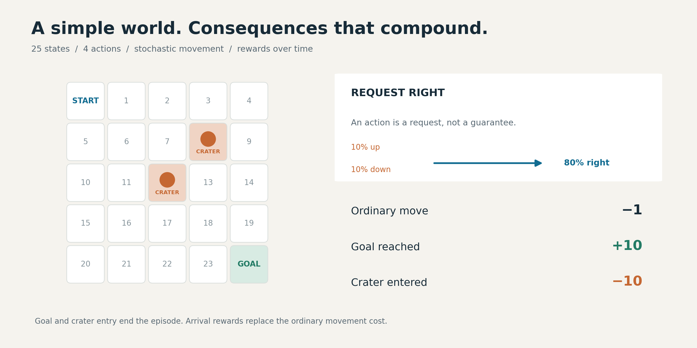
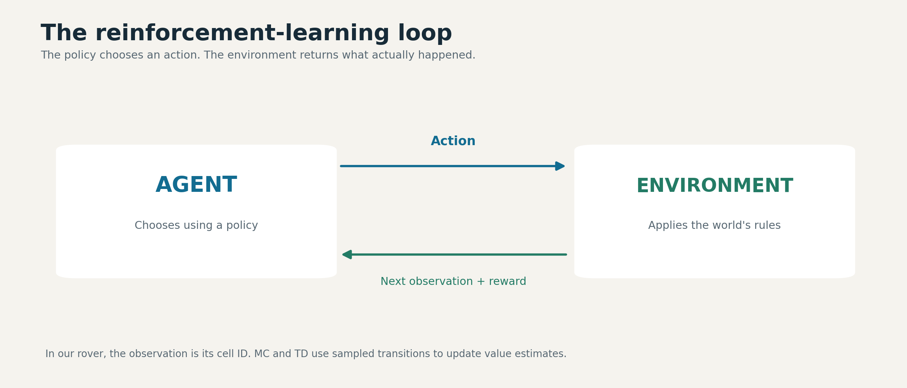
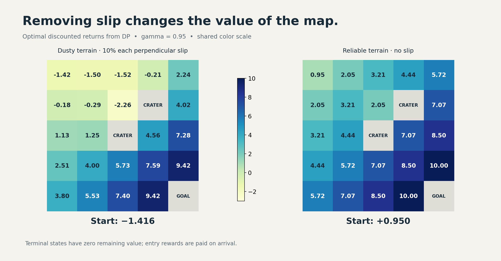
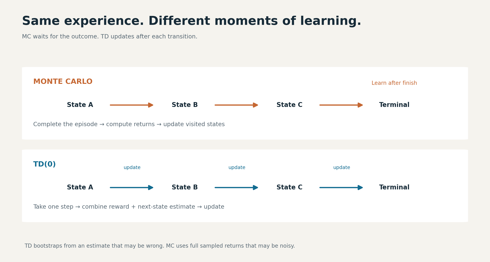
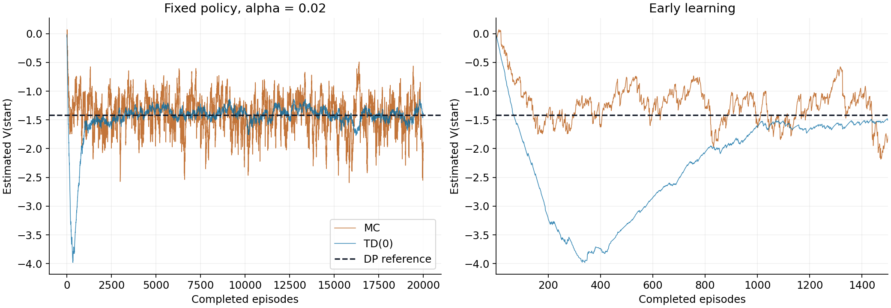
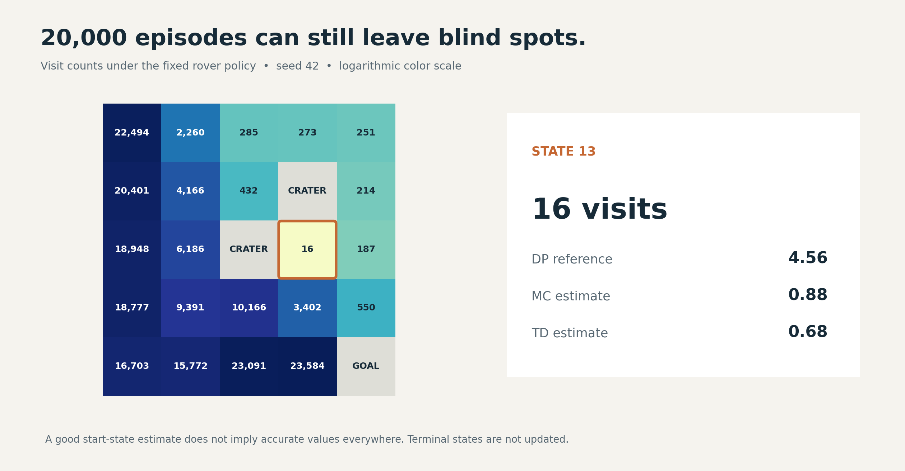

# We Built a Mars Rover to Understand How Reinforcement Learning Actually Learns

*Three ways to value a decision, 40,000 simulated episodes, and a lesson about why an accurate-looking learning curve can hide important gaps.*

Our first rover fell into a crater after 11 moves.

It had a map, four possible actions, and a clear destination. What it did not have was a useful rule for choosing those actions. It moved randomly until a request to go right took it directly into a hazard.

We then gave the same world to three methods: dynamic programming, Monte Carlo, and temporal-difference learning. The environment stayed small enough to inspect cell by cell. That made it possible to ask questions that are easy to lose inside a larger AI system:

What does the agent actually know? What is it learning from? How do we tell whether an estimate is accurate? And when one algorithm appears better, what exactly do we mean by “better”?

After 20,000 episodes per learning method, TD estimated the start state's value much more closely than Monte Carlo at the final checkpoint. But one nearby-looking region of the map remained poorly understood by both methods. The reason was simple: the rover had barely visited it.

That combination—successful learning and a visible blind spot—is what makes this experiment useful.

**The experiment and code**

The companion notebook contains the environment implementations, all three algorithms, assertions, value grids, and convergence plots. The complete implementation and executed results are available in the public repository below. You can also [run the notebook in Google Colab](https://colab.research.google.com/github/anshubansal2000/ReinforcementLearning/blob/main/mars_rover_assignment.ipynb).

- [Experiment notebook and code][repository]
- [Executed notebook][notebook]
- [Convergence plot][convergence]
- [Numerical results][results]

**A small world with a real decision problem**

Reinforcement learning studies how an agent can use interaction and reward to make sequential decisions. A move matters because of both its immediate consequences and the opportunities it creates afterward.



*The environment defines the possible outcomes and rewards. The agent chooses which action to request.*

Our rover lives in a 5×5 grid:

```text
S  .  .  .  .
.  .  .  X  .
.  .  X  .  .
.  .  .  .  .
.  .  .  .  G
```

`S` is the start, `X` marks a crater, and `G` is the science target. Each cell is a state; each action requests up, right, down, or left.

The complication is dust. A requested move succeeds in its intended direction 80% of the time. Each perpendicular direction receives a 10% slip probability. At a wall, movement is clipped, so the rover may stay in place.

An ordinary move costs −1. Entering a crater gives −10 and ends the episode. Reaching the goal gives +10 and ends the episode. These arrival rewards replace the ordinary movement cost.

This gives us the ingredients of a Markov decision process: states, actions, transition probabilities, rewards, and a discount factor. Here, the current cell contains the information needed to determine the distribution of the next outcome. We use a discount factor of 0.95, which gives later rewards progressively less weight.

We implemented the world using [Gymnasium](https://gymnasium.farama.org/), which provides a standard interface for reinforcement-learning environments. `reset()` begins an episode; `step(action)` returns the next observation, reward, and episode-ending information.



The first random episode exposed a detail worth noticing:

```text
(0, 2, -1.0, 1)
```

Reading this as `(state, action, reward, next_state)`, the rover requested down from state 0 but arrived at state 1, to its right. The action was a request. The environment determined what actually happened.

That distinction becomes central when we start evaluating decisions.

**Bellman's idea: judge the next move by what comes after it**

Imagine choosing a route home. One road takes ten minutes to reach a junction where you expect another twenty minutes of travel. Another takes five minutes to reach a junction where thirty-five minutes remain.

The shorter first leg does not make the second route better. You need the immediate cost and the value of the remaining journey.

The rover faces the same question. A state value estimates the discounted total reward still to come. An action's value combines its immediate reward with the estimated value of where it might lead.

For a stochastic world, we must average across possible outcomes:

```text
Action estimate = sum over outcomes of
                  probability × (reward + discounted next-state value)
```

At a terminal outcome, there is no remaining future value.

Consider state 23, immediately left of the goal. Requesting right reaches the goal with probability 0.8, slips upward with probability 0.1, or bumps into the bottom wall with probability 0.1.

If our initial future-value estimates are all zero, the action estimate is:

```text
0.8 × 10 + 0.1 × (−1) + 0.1 × (−1) = 7.8
```

The rover never receives a reward of 7.8 on that individual transition. It is an expectation across possible outcomes.

**Experiment 1: calculate the answer when the model is known**

Dynamic programming uses the transition model directly. In our implementation, `P[state][action]` lists possible outcomes, their probabilities, rewards, and termination flags.

Value iteration starts every state at zero, evaluates every action, and replaces each nonterminal state's estimate with the largest action value. It repeats this process until the largest change during a sweep falls below 0.000001.

Because the map contains loops, this takes repeated sweeps. Updated estimates carry information about the goal, movement costs, and hazards through the grid.

The resulting optimal values were:

```text
 -1.42  -1.50  -1.52  -0.21   2.24
 -0.18  -0.29  -2.26   0.00   4.02
  1.13   1.25   0.00   4.56   7.28
  2.51   4.00   5.73   7.59   9.42
  3.80   5.53   7.40   9.42   0.00
```

The zeros at the goal and craters represent zero *remaining* reward after arrival. Their entry rewards have already been paid.

Choosing the best action at each state produced this policy:

```text
v  v  >  >  v
v  v  <  X  v
v  v  X  v  v
v  >  v  v  v
>  >  >  >  G
```

From the start, the policy favors moving down, eventually approaching the goal along the bottom. The arrows account for possible slips; they do not describe a guaranteed trajectory.

The start state's value was **−1.416**. A negative value does not mean the policy necessarily fails. Movement costs, discounting, detours, and occasional failures all contribute to expected return.

We also verified the result in two ways: the remaining Bellman update error was approximately 1.23×10⁻⁷, and an independent linear-equation evaluation of the extracted policy agreed within the notebook's tolerance.

**What happens when the dust disappears?**

We changed the slip probability to zero and solved the world again. The start value rose from **−1.416 to +0.950**.



*Reliable movement raises values throughout the nonterminal grid. Gray cells mark terminal states.*

The result is independently interpretable. A shortest safe route takes eight moves: seven ordinary rewards of −1 followed by the goal reward of +10, with discounting applied along the way.

Near a crater, the effect is particularly intuitive. State 11, immediately left of the central crater, increased from **1.25 to 4.44**. Reliable movement makes it possible to travel beside a hazard without accidentally entering it.

This experiment puts a number on the cost of uncertain movement. It also shows why distance alone is an incomplete measure of a good position.

**Experiment 2: learn the values through experience**

Next, we removed the learning algorithms' access to the model. Monte Carlo and TD received only episode resets and sampled transitions. They followed the same fixed policy extracted from the stochastic-world DP solution.

This distinction matters: DP found an optimal policy; MC and TD then evaluated that policy. The learning methods were not discovering or improving their own action-selection strategies in this experiment.

The setup was deliberately controlled:

| Setting | Choice |
|---|---|
| Episodes | 20,000 per method |
| Starting state | Always the top-left cell |
| Initial values | Zero |
| Discount factor | 0.95 |
| Learning rate | Constant 0.02 |
| Random seed | 42 |
| Experience | Same seeded trajectories for both methods |
| Checkpoints | 1,000, 5,000, and 20,000 episodes |

We confirmed identical visit counts for the paired runs. This reduces differences caused by receiving different trajectories, while still leaving the important limitation of a single seed.



*Same fixed policy and paired experience, different learning targets and update timing.*

**Monte Carlo: finish the journey, then learn from it**

Monte Carlo waits for the episode to finish. It calculates the discounted rewards remaining after each visit and nudges that state's estimate toward the observed return.

In plain language: “Now that I know how the trip ended, how good was it to be at each place along the way?”

Our implementation uses every-visit updates, so one episode can teach it about many states. A late crater or a sequence of detours changes the returns assigned to earlier visits. That direct connection to complete outcomes is useful, but it can produce substantial variability.

**TD: revise the forecast after each step**

Temporal-difference learning updates before the journey is over. Its target is the reward just observed plus the discounted estimate of the next state's value.

Suppose the rover currently values a cell at 3. It pays −1 to move into a cell it values at 6. The new target is:

```text
−1 + 0.95 × 6 = 4.7
```

With a learning rate of 0.02, the old estimate changes only slightly:

```text
3 + 0.02 × (4.7 − 3) = 3.034
```

TD is learning partly from another estimate. This is called bootstrapping. That estimate can be wrong, especially early on, but TD can update after every transition without waiting for the final outcome. Terminal transitions use the observed reward alone.

For a deeper treatment of these methods, the foundational reference is Sutton and Barto's [Reinforcement Learning: An Introduction](https://incompleteideas.net/book/the-book-2nd.html).

**The results: TD was steadier, but “best” needs a definition**

The top-left entry in each value grid gives this comparison:

| Episodes | Monte Carlo | TD(0) | DP reference |
|---|---:|---:|---:|
| 1,000 | −1.54 | −1.62 | −1.416 |
| 5,000 | −1.50 | −1.29 | −1.416 |
| 20,000 | −1.89 | −1.40 | −1.416 |

At the final checkpoint, TD was much closer to the reference. Its fluctuations over the final 5,000 episodes were also smaller: a standard deviation of **0.104**, compared with **0.337** for MC. These numbers describe variability across consecutive estimates, not confidence intervals across independent experiments.



*Full training on the left, early learning on the right; one paired seed, alpha 0.02.*

The full [convergence plot][convergence] tells a more useful story than the final values alone. TD initially moved well below the reference as it bootstrapped from incomplete estimates. It later recovered and became steadier. MC approached the reference earlier but kept fluctuating more.

Using a trailing 500-episode RMSE threshold of 0.5, MC first met the threshold at episode 500 and TD at episode 1,203. That measures early proximity under one chosen criterion, not permanent convergence or general superiority.

A constant learning rate keeps new experience influential. More episodes therefore do not guarantee that every later snapshot is closer to the answer. Our MC estimate illustrates this directly: its 5,000-episode snapshot was better than its 20,000-episode snapshot at the start state.

The defensible conclusion is specific: **TD had lower late-stage start-value variability in this paired run; MC reached our early error threshold sooner.** A broader comparison would require multiple seeds and learning-rate settings.

**The result that a single learning curve would hide**



*Counts include repeated visits within an episode. An accurate start estimate can coexist with poor coverage elsewhere.*

State 13 provides a useful counterpoint:

| State 13 after training | Value |
|---|---:|
| DP reference | 4.56 |
| MC estimate | 0.88 |
| TD estimate | 0.68 |
| Visits | 16 |

Both methods had completed 20,000 episodes. Yet this state received only 16 visits because the fixed policy rarely brought the rover there from the start.

TD's accurate-looking start estimate did not imply an accurate value function everywhere. The upper-right portion of the grid also received relatively little experience.

This suggests a practical evaluation habit: inspect where the data came from alongside the headline metric. In this experiment, visit counts explain an important source of error that a start-state plot cannot show.

For larger systems, the analogous question is whether evaluation covers the situations the deployed policy will encounter. Our tiny grid demonstrates the coverage problem; it does not establish performance claims about a production system.

**Experiment 3: reuse the algorithm in a different world**

To test whether the implementation was tied to the rover, we built a second environment: a delivery drone on a 3×4 grid with a hazardous tower.

An eastward gust replaces the requested movement with probability 0.2. Ordinary moves cost −0.5, hitting the tower gives −6, and delivery gives +8. Tower entry and delivery end the episode.

The same value-iteration function produced:

```text
>  >  >  v
v  v  X  v
>  >  >  G
```

From the start, the drone travels east across the top and then down the right edge. Eastward wind helps the requested movement along the top; on the right boundary, a gust causes a delay rather than pushing the drone into the tower.

Its start value was **4.301**. The algorithm did not change. The transition and reward model did.

This is one benefit of a clear environment interface: we can separate the decision-making method from the particular world being studied.

**Where these ideas lead: AlphaGo, TRPO, and PPO**

The experiment gives us vocabulary for understanding larger systems, although we did not implement these methods here.

AlphaGo combined a policy network that identified promising moves, a value network that estimated game outcomes, and tree search that explored possible continuations. Its original value network trained on completed self-play outcomes. The connection is the separation between choosing actions, valuing positions, and looking ahead. [Original AlphaGo paper](https://www.nature.com/articles/nature16961)

TRPO and PPO address another question: how should a learned policy change after collecting experience? A useful analogy is revising driving habits without overreacting to a few lucky trips. TRPO uses a constraint on policy change; PPO-Clip modifies the learning objective to remove some incentives for excessive probability changes. Clipping is not a hard guarantee that the new policy stays within fixed bounds. [PPO documentation](https://spinningup.openai.com/en/latest/algorithms/ppo.html)

Our next step toward control from experience would be to learn action values and improve the policy while exploring—for example, with Q-learning. That would change the experimental question from “How good is this policy?” to “Can experience help us discover a better one?”

**Reproduce the experiment, then challenge it**

Open the [notebook][notebook] in Google Colab or a local Jupyter environment. Install the dependencies and run its cells in order:

```python
%pip install "gymnasium==1.3.0" numpy matplotlib
```

A CPU is sufficient. The notebook includes the random episode, model checks, DP verification, six learning checkpoint grids, visit counts, and convergence plots. The repository's requirements file records the local reference environment; the short installation command above does not pin every dependency.

Once the baseline runs, try three extensions. These are proposed follow-up experiments, not results reported here:

1. **Repeat across several seeds.** Check whether the early-speed and late-variability patterns persist.
2. **Vary the learning rate.** Compare a small constant step size with a decreasing schedule and measure both early progress and late error.
3. **Broaden starting-state coverage.** Start episodes from additional nonterminal cells and inspect whether poorly visited regions improve. This changes the sampling setup, so report it explicitly.

Before celebrating a learning curve, ask what it measures, what experience produced it, and which parts of the problem it leaves unseen. In our experiments, those questions revealed more than declaring a winner between MC and TD.

*Experiment provenance: the rover specification was adapted from Vizuara AI Labs' [RL in Production, Lecture 01 exercise](https://rl-bootcamp-decks.vercel.app/pdfs/lecture-01-assignment.pdf). We implemented the environments and algorithms, ran the comparisons, and analyzed the results presented here. The methods are established RL techniques; the contribution of this article is the reproducible walkthrough and interpretation.*

[repository]: https://github.com/anshubansal2000/ReinforcementLearning
[notebook]: https://github.com/anshubansal2000/ReinforcementLearning/blob/main/mars_rover_assignment.ipynb
[convergence]: https://github.com/anshubansal2000/ReinforcementLearning/blob/main/results/convergence.png
[results]: https://github.com/anshubansal2000/ReinforcementLearning/blob/main/results/metrics.json
